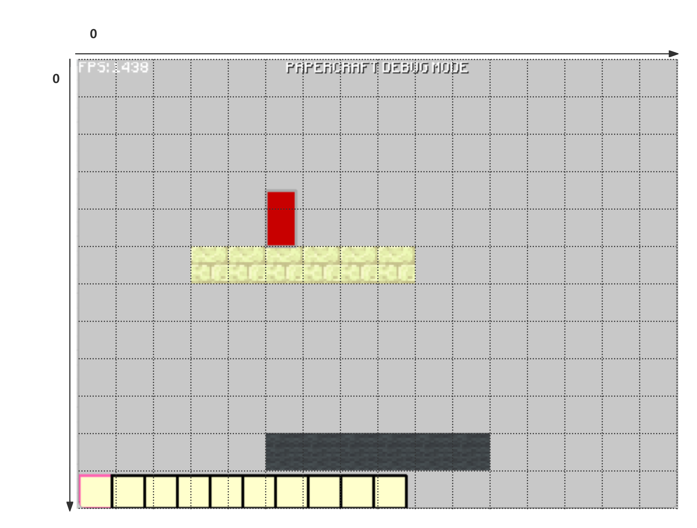

后来的朋友们，希望你们足够强大以完成游戏主场景，我太菜了难以胜任）
还在准备数模，没太多时间细写O_o

# 看完目前源码的感受
佬们别炫技了，后面的佬们把现有的n多个类实现一下吧，不然太浪费了

我**尝试**实现一下背包**吧**（tips: 头文件里的beg其实是bag

# 目前存在的bug
1. 站在上面一行的砖块会莫名其妙抖动，下面一行却不抖
2. 左脚踩右脚上天

# TODO
AKA未必做成功的
1. 修复左脚踩右脚上天和帕金森的机制
2. 完善玩家死亡逻辑，玩家死亡后自动开始钓鱼，钓到*飞飞鱼鱼丸丸*就可以复活回到主界面（如果没钓上则彻底死亡返回主界面
3. 钓到的🐟可以放进背包里

# DOING
1. 钓鱼场景因为用的是基类指针，所以要调用FishingScene的接口我只能想到强制类型转换。至于为什么是基类指针，参考F的注释
2. 感觉好像缺失了一个场景管理器，但Scene的子类OnExit函数好像并没有实现，后来人可以做一个场景管理器统一管理一下（为了方便我稍微破坏了一点封装（*私密马赛*
3. 我好像没弄懂背包的这个物品咋用?_?
4. 玩家我做了三个状态，但是没用状态机，因为这个目前没有什么分别的执行逻辑，暂且用枚举先替代一下
5. 亲爱的朋友们，当你看到这条时
   -------------------------
   我离结束还有2个小时，但是还是没解决碰撞箱的bug……我决定将碰撞箱还原成我改之前的样子，别给你们添乱了
   好奇怪啊，真的好奇怪啊，为什么只有站在上层的头会抽搐，脚却不抽搐？？？
   建议后面的朋友不要管这个了，实在不行，留着当特性吧
6. 芒果佬那部分我已经没时间去研究了
7. 帮后面的朋友们做了一个坐标系方便大家参考做地图
   

# DONE
只做成功了飞鱼丸复活币………………失败のman
和碰撞箱碰撞了很久但是没有拿下，bug更多了，不如回到最初的起点，留给下一个幸运儿

# END
最后，还是希望大家不要重蹈覆辙，只关注看得见的内容就好，看不懂的不用去管，bug能修就修，修不了只要程序能跑就行

*秦人不暇自哀，而后人哀之；后人哀之而不鉴之，亦使后人而复哀后人也。*