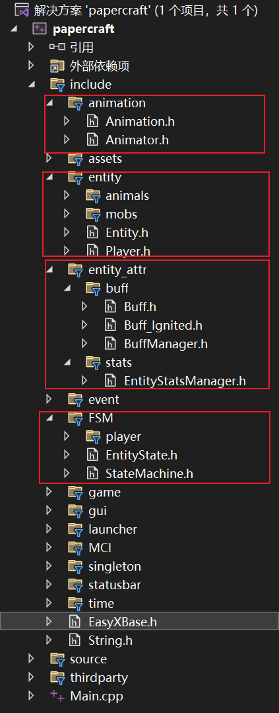

## 写在前面
- 因为我之前只写过Unity封装好的那些语法，对那些组件的底层暂时不是很清楚，并且V大的课我还没跟完，所以我就没有开游戏的主循环部分（省得瞎写给大家添乱），故而我只写了些大家可能会用到的系统的简单结构，如下图红框内所示

- 头文件内的函数方法均没有写对应的`.cpp`实现，具体的实现可能需要看游戏的物理系统如何实现，以及需要看主循环部分的逻辑是怎样的，不然不好写，所以给大家

- 后面的朋友如果觉得这些东西不好的话请随意删改（）

## 重要的类的解释（详见注释）
- `PEntity类`：游戏内各种实体（如MC中的玩家、生物、矿车/盔甲架）的基类，用于维护实体各种基本性质

- `PStateMachine`类：有限状态机，管理各种状态

- `PEntityStatsManager`类：管理实体的各类数值

- `PBuffManager`类：管理实体的给雷Buff

- `PAnimator`类：管理实体的各种动画